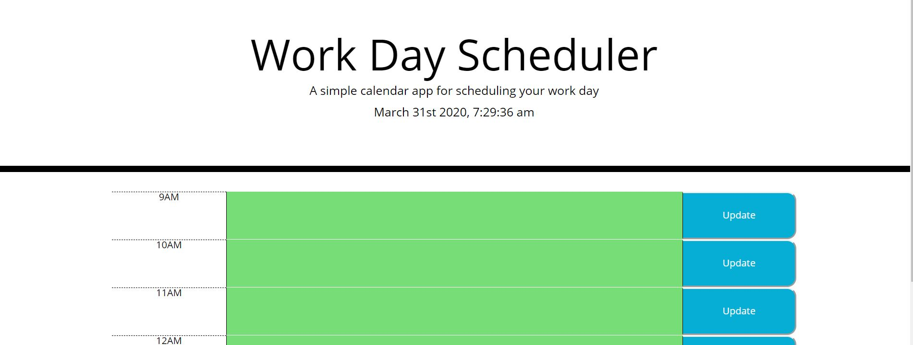

# Project Title

Homework 5 - Work Day Scheduler by Erik Adames

## Location of URLs

This is the link to the github repo:

https://github.com/egadames/hw5

This is the link to the live website:

https://egadames.github.io/hw5/

### Description

- The app is a website loads a Work Day Planner

- The planner contains timeblocks for the current workday. It contains the current date and time at the top.

- The timeblocks are highlighted by different colors depending if it is the past, present or future.

- The middle timeblock is an text area that allows user to enter events and once the save button is clicked it is sent into local storage.

- This allows the user to refresh and the even will still be inside the text box.

### Technologies

- The website uses HTML, CSS and Jquery.

### Challenges

- This app was of medium challenge as a lot of the styling was already provided in the CSS file. So it was mostly trying to get the classes to matchup so the styling to take effect.

- The most difficult issue were trying to make the event listener work properly. There was some issues with making the code work on each textarea and locating the text area that was updated.

- By the end I was able to get a good grasp of using Jquery and how to create the HTML elements with a JS file. Also, got a good understanding of how to make the event listener work and load into local storage

### Screenshot

